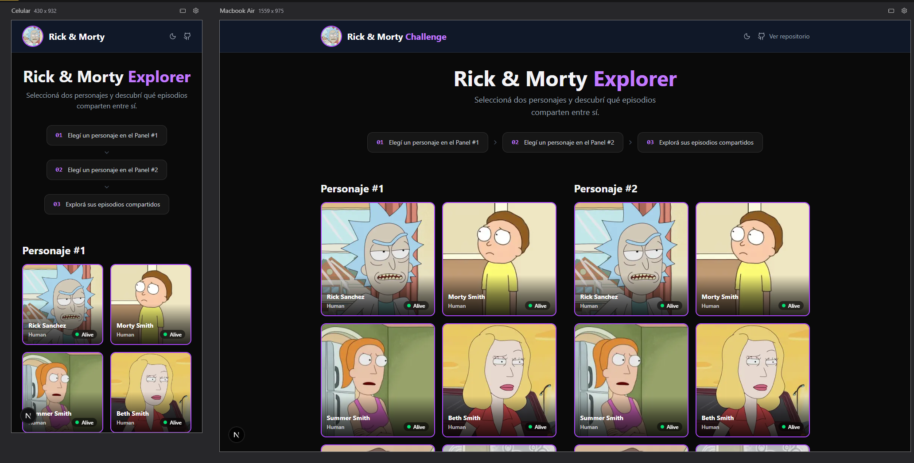
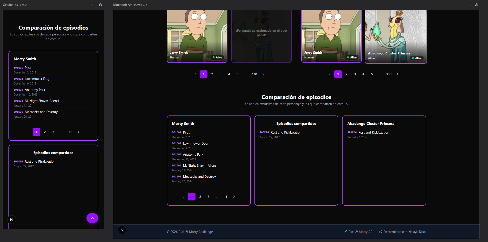
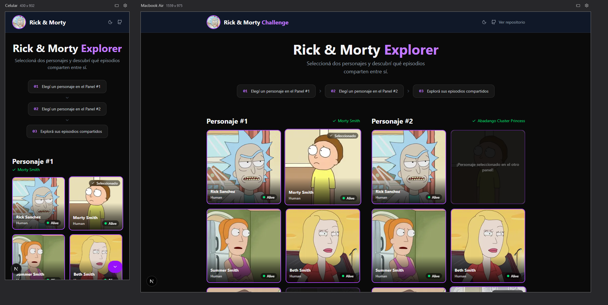
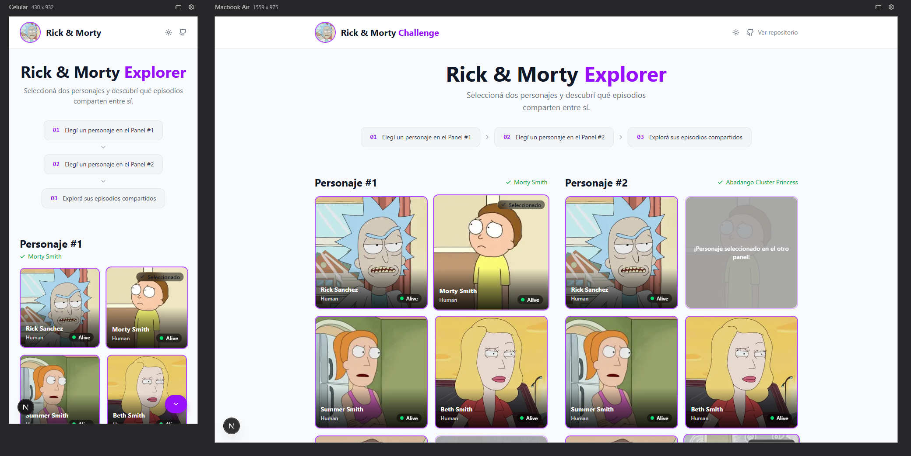
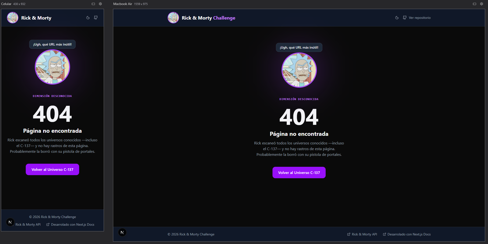
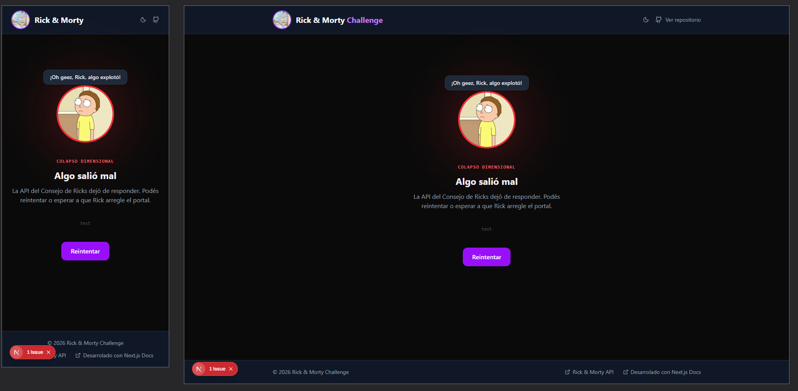

# Rick & Morty Explorer

Una aplicación web que permite explorar los personajes del universo Rick & Morty, seleccionar dos de ellos y comparar los episodios que comparten entre sí.

Construida como challenge técnico usando Next.js 16 con App Router, Tailwind CSS v4 y la API pública de Rick & Morty.

**[Ver demo en vivo →](https://rick-and-morty-challenge-sooty.vercel.app/)**

---

## Capturas de pantalla

### Página principal


### Selección y comparación de episodios


### Tema oscuro


### Tema claro


### Página 404


### Error boundary (colapso dimensional)


---

## Características principales

- **Dos paneles de personajes** con paginación independiente — cada panel mantiene su propio estado sin afectar al otro.
- **Paginación windowed** con caché inteligente: muestra 6 personajes por página (UI) mapeados sobre las páginas de 20 de la API, fetching únicamente las páginas faltantes.
- **Comparación de episodios** en tres columnas: todos los episodios del personaje 1, los compartidos, y todos los del personaje 2.
- **Selector de tema** (claro / oscuro / sistema) persistido en `localStorage`, sincronizado con `prefers-color-scheme`.
- **Scroll FAB** (Floating Action Button) que aparece solo en mobile, cuando ambos personajes están seleccionados y permite navegar entre los paneles y la sección de episodios.
- **Error Boundary** personalizado (`error.tsx`) con diseño consistente a la app.
- **Página 404** personalizada (`not-found.tsx`).
- **Loading skeleton** durante la carga inicial de los paneles con `Suspense`.
- **Open Graph image** generada dinámicamente con `opengraph-image.tsx`.

---

## Stack tecnológico

| Tecnología | Versión | Rol |
|---|---|---|
| [Next.js](https://nextjs.org) | 16 | Framework principal (App Router) |
| [React](https://react.dev) | 19 | UI Library |
| [TypeScript](https://www.typescriptlang.org) | 5 | Tipado estático |
| [Tailwind CSS](https://tailwindcss.com) | 4 | Estilos utilitarios |
| [Zustand](https://zustand-demo.pmnd.rs) | 5 | Estado global (personajes seleccionados) |
| [CVA](https://cva.style) | 0.7 | Variantes de componentes con type-safety |
| [Lucide React](https://lucide.dev) | 0.575 | Íconos SVG |
| [Jest](https://jestjs.io) | 30 | Test runner |
| [React Testing Library](https://testing-library.com/react) | 16 | Testing de componentes |
| [pnpm](https://pnpm.io) | — | Package manager |

### API

La aplicación consume la [Rick and Morty API](https://rickandmortyapi.com) a través de su **API REST**.

---

## Arquitectura y decisiones de diseño

### Separación SSR / Client

El browser nunca llama directamente a la API externa. Las peticiones client-side pasan por route handlers internos de Next.js, que actúan como proxy hacia `rickandmortyapi.com`.

| Función | Contexto | Estrategia |
|---|---|---|
| `getCharactersPage(page)` | Servidor (SSR) | `fetch` directo a API externa con `next: { revalidate: 86400 }` |
| `fetchCharactersPage(page)` | Cliente | `fetch` a `/api/characters` (proxy interno, revalidate: 3600) |
| `fetchEpisodes(ids, signal?)` | Cliente | `fetch` a `/api/episodes` (proxy interno, revalidate: 86400) + `AbortSignal` |

### Paginación en dos niveles

La API devuelve 20 personajes por página. La UI muestra 6. El hook `usePagination` mantiene un `Map<apiPage, Character[]>` como caché en memoria y calcula qué página(s) de la API necesita cada página de UI, fetching solo las que faltan.

```
API page 1 → chars 1-20
UI page 1  → chars 1-6   (API page 1, cached)
UI page 2  → chars 7-12  (API page 1, cached, sin fetch)
UI page 4  → chars 19-24 (API page 1 cached + API page 2 fetch solo lo faltante)
```

### Estado global

Zustand administra el estado de selección de personajes en dos slots (`char1`, `char2`). Cada `CharacterCard` lee directamente del store sin prop-drilling. La lógica de toggle (seleccionar → deseleccionar al hacer click de nuevo) y de disabled (si el personaje ya está en el otro panel) vive en el componente.

### Componentes compound

El componente `Card` sigue el patrón compound con propiedades estáticas:

```tsx
<Card>
  <Card.Media src={...} alt={...} />
  <Card.Overlay>
    <Card.Descripcion>...</Card.Descripcion>
  </Card.Overlay>
  <Card.Badge status="Alive" />
</Card>
```

### Estructura de carpetas

```
├── app/
│   ├── api/
│   │   ├── characters/route.ts   # Proxy → rickandmortyapi.com/character
│   │   └── episodes/route.ts     # Proxy → rickandmortyapi.com/episode
│   ├── page.tsx                  # Home (Server Component)
│   ├── layout.tsx                # Root layout
│   ├── error.tsx                 # Error boundary global
│   ├── not-found.tsx             # Página 404
│   ├── loading.tsx               # Fallback de carga
│   └── opengraph-image.tsx       # OG image dinámica
├── components/
│   ├── features/                 # Componentes de producto
│   │   ├── AppIntro.tsx
│   │   ├── CharacterCard.tsx
│   │   ├── PanelCharacters.tsx
│   │   ├── PanelsSection.tsx     # Async Server Component
│   │   ├── ScrollFAB.tsx
│   │   ├── EpisodeComparison/    # Comparación de episodios
│   │   └── ThemeSelector/        # Selector de tema
│   ├── layout/                   # Header, Footer, Skeletons
│   └── ui/                       # Design system
│       ├── Card/                 # Compound component
│       ├── Pagination/           # Paginación windowed
│       ├── EpisodeList/          # Lista de episodios
│       ├── Spinner/
│       ├── Skeletons/
│       └── ThemeToggle/
├── hooks/
│   ├── usePagination.ts          # Paginación remota con caché
│   └── useLocalPagination.ts     # Paginación local (episodios)
├── libs/
│   ├── api/
│   │   ├── characters.ts         # getCharactersPage + fetchCharactersPage
│   │   ├── episodes.ts           # fetchEpisodes (batch por IDs)
│   │   └── utils.ts              # buildEpisodeSets
│   ├── types/index.ts            # Tipos TypeScript del dominio
│   └── constants/pagination.ts  # UI_PAGE_SIZE=6, API_PAGE_SIZE=20
├── store/
│   └── comparisonStore.ts        # Zustand store
└── __tests__/                    # Tests espejo de la arquitectura
```

---

## Instalación y uso

> La aplicación está desplegada en Vercel y se puede usar directamente en:
> **https://rick-and-morty-challenge-sooty.vercel.app/**

### Requisitos

- Node.js 20+
- pnpm

### Instalación

```bash
git clone https://github.com/Lautimb/rick-and-morty-challenge.git
cd rick-and-morty-challenge
pnpm install
```

### Variables de entorno

Crear un archivo `.env.local` en la raíz del proyecto tomando como base `.env.example`:

```bash
cp .env.example .env.local
```

| Variable | Descripción |
|---|---|
| `RICK_MORTY_API_BASE_URL` | URL base de la API externa (ver `.env.example`) |

### Comandos disponibles

```bash
# Servidor de desarrollo
pnpm dev

# Build de producción
pnpm build

# Iniciar en producción
pnpm start

# Linting
pnpm lint

# Tests
pnpm test

# Tests en modo watch
pnpm test:watch

# Tests con reporte de cobertura
pnpm test:coverage
```

Abre [http://localhost:3000](http://localhost:3000) en el navegador.

---

## Testing

El proyecto cuenta con una suite de tests unitarios con **cobertura global del 98%**, organizados en una carpeta `__tests__/` con arquitectura espejo al código fuente.

### Resultados de cobertura

| Métrica | Cobertura |
|---|---|
| Statements | **97.43%** |
| Branches | **96.28%** |
| Functions | **95.23%** |
| Lines | **97.43%** |

### Estructura de tests

```
__tests__/
├── app/
│   └── page.test.tsx
├── components/
│   ├── features/
│   │   ├── EpisodeComparison/    # EpisodeColumn, EpisodeColumnShell, EpisodeList,
│   │   │                         # SharedEpisodes, EpisodeComparison
│   │   ├── ThemeSelector/
│   │   ├── AppIntro.test.tsx
│   │   ├── CharacterCard.test.tsx
│   │   ├── PanelCharacters.test.tsx
│   │   └── ScrollFAB.test.tsx
│   ├── layout/                   # Header, Footer, SkeletonHome
│   └── ui/                       # Card, Pagination, Spinner, Skeletons, EpisodeList, ThemeToggle
├── hooks/
│   ├── usePagination.test.ts
│   └── useLocalPagination.test.ts
├── libs/api/
│   ├── characters.test.ts
│   ├── episodes.test.ts
│   └── utils.test.ts
└── store/
    └── comparisonStore.test.ts
```

---

## Dependencias

### Producción

| Paquete | Versión | Descripción |
|---|---|---|
| `next` | 16.1.6 | Framework React con SSR, App Router y optimización de imágenes |
| `react` | 19.2.3 | Librería de UI |
| `react-dom` | 19.2.3 | Renderer para web |
| `zustand` | 5.0.11 | Estado global mínimo y predecible |
| `class-variance-authority` | 0.7.1 | Variantes de clases CSS con TypeScript |
| `lucide-react` | 0.575.0 | Íconos SVG tree-shakeable |

### Desarrollo

| Paquete | Versión | Descripción |
|---|---|---|
| `typescript` | 5 | Tipado estático |
| `tailwindcss` | 4 | Framework CSS utilitario |
| `@tailwindcss/postcss` | 4 | Integración PostCSS para Tailwind v4 |
| `eslint` | 9 | Linter |
| `eslint-config-next` | 16.1.6 | Reglas ESLint recomendadas para Next.js |
| `jest` | 30.2.0 | Test runner |
| `jest-environment-jsdom` | 30.2.0 | Entorno DOM para tests |
| `@testing-library/react` | 16.3.2 | Testing de componentes React |
| `@testing-library/jest-dom` | 6.9.1 | Matchers adicionales para DOM |
| `@testing-library/user-event` | 14.6.1 | Simulación de interacciones de usuario |
| `@types/jest` | 30.0.0 | Tipos TypeScript para Jest |
| `@types/node` | 20 | Tipos TypeScript para Node.js |
| `@types/react` | 19 | Tipos TypeScript para React |
| `@types/react-dom` | 19 | Tipos TypeScript para ReactDOM |

---

## Licencia

MIT
